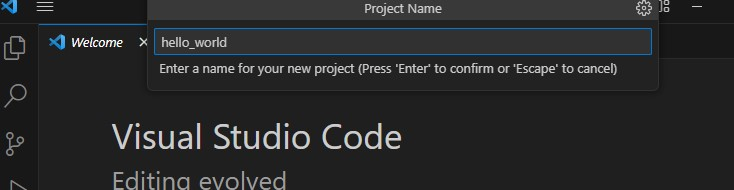
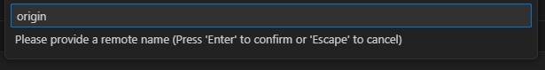
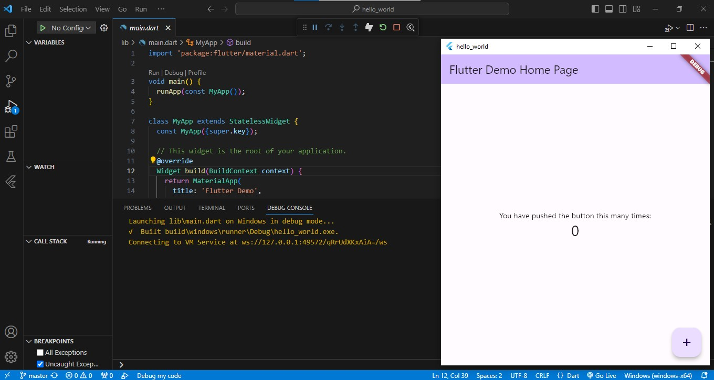
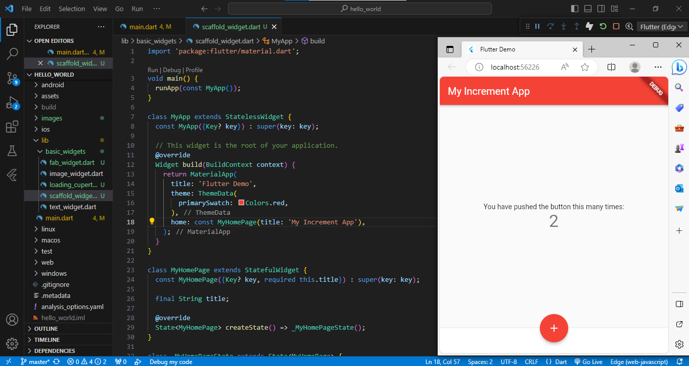

# hello_world

A new Flutter project.

<b>Praktikum 1: Membuat Project Flutter Baru</b>

Langkah 1:
Buka VS Code, lalu tekan tombol Ctrl + Shift + P maka akan tampil Command Palette, lalu ketik Flutter. Pilih New Application Project.

Langkah 2:
Kemudian buat folder sesuai style laporan praktikum yang Anda pilih. Disarankan pada folder dokumen atau desktop atau alamat folder lain yang tidak terlalu dalam atau panjang. Lalu pilih Select a folder to create the project in.

Langkah 3:
Buat nama project flutter hello_world seperti berikut, lalu tekan Enter. Tunggu hingga proses pembuatan project baru selesai.

Langkah 4:
Jika sudah selesai proses pembuatan project baru, pastikan tampilan seperti berikut. Pesan akan tampil berupa "Your Flutter Project is ready!" artinya Anda telah berhasil membuat project Flutter baru.

<b>Praktikum 2: Membuat Repository GitHub dan Laporan Praktikum</b>

Langkah 1:
Login ke akun GitHub Anda, lalu buat repository baru dengan nama "flutter-fundamental-part1"

Langkah 2:
Lalu klik tombol "Create repository" lalu akan tampil seperti gambar berikut.

Langkah 3:
Kembali ke VS code, project flutter hello_world, buka terminal pada menu Terminal > New Terminal. Lalu ketik perintah berikut untuk inisialisasi git pada project Anda.

Langkah 4:
Pilih menu Source Control di bagian kiri, lalu lakukan stages (+) pada file .gitignore untuk mengunggah file pertama ke repository GitHub.

Langkah 5:
Beri pesan commit "tambah gitignore" lalu klik Commit (✔)

Langkah 6:
Lakukan push dengan klik bagian menu titik tiga > Push

Langkah 7:
Di pojok kanan bawah akan tampil seperti gambar berikut. Klik "Add Remote"

Langkah 8:
Salin tautan repository Anda dari browser ke bagian ini, lalu klik Add remote

Setelah berhasil, tulis remote name dengan "origin"

Langkah 9:
Lakukan hal yang sama pada file README.md mulai dari Langkah 4. Setelah berhasil melakukan push, masukkan username GitHub Anda dan password berupa token yang telah dibuat (pengganti password konvensional ketika Anda login di browser GitHub). Reload halaman repository GitHub Anda, maka akan tampil hasil push kedua file tersebut seperti gambar berikut. Untuk file README.md: 

Hasil push kedua file tersebut di repo:

Langkah 10:
Lakukan push juga untuk semua file lainnya dengan pilih Stage All Changes. Beri pesan commit "project hello_world". Maka akan tampil di repository GitHub Anda seperti berikut.

Langkah 11:
Kembali ke VS Code, ubah platform di pojok kanan bawah ke emulator atau device atau bisa juga menggunakan browser Chrome. Lalu coba running project hello_world dengan tekan F5 atau Run > Start Debugging. Tunggu proses kompilasi hingga selesai, maka aplikasi flutter pertama Anda akan tampil seperti berikut.

Langkah 12:
Silakan screenshot seperti pada Langkah 11, namun teks yang ditampilkan dalam aplikasi berupa nama lengkap Anda. Simpan file screenshot dengan nama 01.png pada folder images (buat folder baru jika belum ada) di project hello_world Anda. Lalu ubah isi README.md seperti berikut, sehingga tampil hasil screenshot pada file README.md. Kemudian push ke repository Anda. Mengubah teks yang ditampilkan dengan nama lengkap dan angka yang ditampilkan sesuai dengan no absen saya yaitu 10: 

Mengubah isi README.md dan menampilkan hasil screenshot pada file README.md: 

<b>Praktikum 3: Menerapkan Widget Dasar</b>

Langkah 1: Text Widget
Buat folder baru basic_widgets di dalam folder lib. Kemudian buat file baru di dalam basic_widgets dengan nama text_widget.dart. Ketik kode program berikut ke project hello_world pada file text_widget.dart.

Penjelasan:
1. Import Package flutter/material.dart: Ini adalah bagian pertama dari kode yang mengimpor pustaka flutter/material.dart. Pustaka ini berisi berbagai widget dan komponen yang diperlukan untuk membangun antarmuka pengguna dalam Flutter.
2. Deklarasi Kelas MyTextWidget: Ini adalah deklarasi kelas MyTextWidget. Kelas ini merupakan turunan dari StatelessWidget, yang berarti bahwa widget ini tidak akan berubah (stateless) setelah dibuat. Kelas ini digunakan untuk membuat widget teks kustom yang akan ditampilkan dalam aplikasi Flutter.
3. Konstruktor MyTextWidget: Ini adalah konstruktor kelas MyTextWidget. Konstruktor ini tidak menerima parameter tambahan dan hanya memanggil konstruktor dari kelas induk (super(key: key)).
4. Method build: Ini adalah method yang wajib ada dalam setiap widget Flutter yang merupakan turunan dari StatelessWidget atau StatefulWidget. Method ini harus diimplementasikan dan akan dipanggil oleh Flutter ketika widget perlu dibangun ulang. Method build mengembalikan sebuah widget, dan inilah tempat menentukan tampilan dan tata letak dari widget.
5. Widget Text: Di dalam method build, kita memiliki widget Text. Widget Text digunakan untuk menampilkan teks dalam aplikasi Flutter. Di dalam Text, terdapat beberapa properti yang diatur:
    - "Nama saya Arhan Windu Rizki Putra Budianto, sedang belajar Pemrograman Mobile": Ini adalah teks yang akan ditampilkan oleh widget Text.
    - style: Properti ini digunakan untuk mengatur gaya teks, seperti warna dan ukuran font. Dalam contoh ini, teks akan ditampilkan dengan warna merah (Colors.red) dan ukuran font 14.
    - textAlign: Properti ini digunakan untuk mengatur perataan teks. Di sini, teks diatur untuk berada di tengah (TextAlign.center).

Melakukan import file text_widget.dart ke main.dart, lalu ganti bagian text widget dengan kode di atas. Maka hasilnya seperti gambar berikut.

Langkah 2: Image Widget
Buat sebuah file image_widget.dart di dalam folder basic_widgets dengan isi kode berikut.

Penjelasan:
1. Import Package flutter/material.dart: Ini adalah bagian pertama dari kode yang mengimpor pustaka flutter/material.dart, yang berisi berbagai widget dan komponen yang diperlukan untuk membangun antarmuka pengguna dalam Flutter.
2. Deklarasi Kelas MyImageWidget: Ini adalah deklarasi kelas MyImageWidget. Kelas ini merupakan turunan dari StatelessWidget, yang berarti bahwa widget ini tidak akan berubah (stateless) setelah dibuat. Kelas ini digunakan untuk membuat widget gambar kustom yang akan ditampilkan dalam aplikasi Flutter.
3. Konstruktor MyImageWidget: Ini adalah konstruktor kelas MyImageWidget. Konstruktor ini tidak menerima parameter tambahan dan hanya memanggil konstruktor dari kelas induk (super(key: key)).
4. Method build: Ini adalah method yang wajib ada dalam setiap widget Flutter yang merupakan turunan dari StatelessWidget atau StatefulWidget. Method ini harus diimplementasikan dan akan dipanggil oleh Flutter ketika widget perlu dibangun ulang. Method build mengembalikan sebuah widget, dan inilah tempat menentukan tampilan dan tata letak dari widget.
5. Widget Image: Di dalam method build, kita memiliki widget Image. Widget Image digunakan untuk menampilkan gambar dalam aplikasi Flutter. Di dalam Image, terdapat beberapa properti yang diatur:
    - image: Properti ini digunakan untuk menentukan sumber gambar yang akan ditampilkan. Dalam contoh ini, kita menggunakan AssetImage("logo_polinema.jpg") sebagai sumber gambar. Ini berarti gambar "logo_polinema.jpg" harus ada di dalam folder assets dalam proyek Flutter.
    - const: Kata kunci const digunakan untuk membuat objek Image menjadi konstan. Ini berarti widget Image ini akan memiliki performa yang lebih baik karena tidak akan dibangun ulang setiap kali widget parent-nya di-rebuild. Namun, perhatikan bahwa jika ingin mengganti gambar secara dinamis, harus menghilangkan kata kunci const ini.

Lakukan penyesuaian asset pada file pubspec.yaml dan tambahkan file logo di folder assets project hello_world.

Menyesuaikan kode dan import di file main.dart kemudian akan tampil gambar seperti berikut.

<b>Praktikum 4: Menerapkan Widget Material Design dan iOS Cupertino</b>

Langkah 1: Cupertino Button dan Loading Bar
Buat file di basic_widgets > loading_cupertino.dart. Import stateless widget dari material dan cupertino. Lalu isi kode di dalam method Widget build adalah sebagai berikut.

Penjelasan:
1. MaterialApp: Ini adalah root widget dari aplikasi. MaterialApp biasanya digunakan untuk mengatur tema dan konfigurasi umum aplikasi. Dalam kasus ini, membuat aplikasi Flutter yang menggunakan tema Material Design.
2. Scaffold: Ini adalah widget yang digunakan untuk mengatur tata letak umum aplikasi, termasuk app bar dan floating action button (FAB). Dalam kode, tidak menyertakan app bar, tetapi dapat menambahkannya jika diperlukan.
3. Container: Ini adalah widget yang digunakan untuk mengatur tata letak dan styling widget lainnya. mengatur margin di bagian atas container dengan margin: const EdgeInsets.only(top: 30), yang membuat jarak 30 piksel dari atas.
4. Column: Ini adalah widget layout yang digunakan untuk menampilkan widget dalam bentuk kolom vertikal. Di dalam Column, memiliki dua children:
    - CupertinoButton: Ini adalah tombol gaya Cupertino (iOS-style button). Tombol ini memiliki teks "Contoh button" dan tidak memiliki aksi (onPressed: () {} adalah tindakan kosong). dapat menambahkan logika yang diinginkan ke dalam onPressed ketika tombol ditekan.
    - CupertinoActivityIndicator: Ini adalah indikator aktivitas gaya Cupertino yang menunjukkan bahwa ada proses yang sedang berlangsung.

Saat ditampilkan hasli runnya akan menampilkan gambar seperti berikut

Langkah 2:Floating Action Button (FAB)
Button widget terdapat beberapa macam pada flutter yaitu ButtonBar, DropdownButton, TextButton, FloatingActionButton, IconButton, OutlineButton, PopupMenuButton, dan ElevatedButton.

Buat file di basic_widgets > fab_widget.dart. Import stateless widget dari material. Lalu isi kode di dalam method Widget build adalah sebagai berikut.

Penjelasan:
1. MaterialApp: Ini adalah root widget dari aplikasi. MaterialApp biasanya digunakan untuk mengatur tema dan konfigurasi umum aplikasi. Dalam kasus ini, membuat aplikasi Flutter yang menggunakan tema Material Design.
2. Scaffold: Ini adalah widget yang digunakan untuk mengatur tata letak umum aplikasi, termasuk app bar dan floating action button (FAB). Dalam kode, hanya menyertakan FloatingActionButton, tetapi dapat menambahkan app bar dan komponen lain jika diperlukan.
3. FloatingActionButton: Ini adalah widget yang digunakan untuk membuat tombol yang mengambang di bagian bawah layar. Di dalam FloatingActionButton, mengatur properti berikut:
    - onPressed: Ini adalah callback yang akan dipanggil ketika tombol ditekan. dapat menambahkan logika yang diinginkan di dalam blok kode yang ditentukan di sini.
    - child: Ini adalah widget yang berada di dalam tombol mengambang. Dalam kasus ini, menggunakan Icon dengan ikon "thumb_up".
    - backgroundColor: Properti ini mengatur warna latar belakang tombol. Dalam kode, tombol memiliki latar belakang berwarna merah muda (Colors.pink).

Saat ditampilkan hasli runnya akan menampilkan gambar seperti berikut

Langkah 3: Scaffold Widget
Scaffold widget digunakan untuk mengatur tata letak sesuai dengan material design.

Buat file di basic_widgets > scaffold_widget.dart. Import stateless widget dari material. Lalu isi kode di dalam method Widget build adalah sebagai berikut.

Penjelasan:
1. main Function: Ini adalah titik masuk utama aplikasi Flutter. Fungsi ini memanggil runApp dengan instance dari MyApp sebagai root widget.
2. MyApp Class: Ini adalah kelas yang mewakili root widget dari aplikasi. Ini adalah turunan dari StatelessWidget. Dalam build method, mendefinisikan tema (theme) dan halaman utama (home) dari aplikasi.
    - title: Ini adalah judul aplikasi yang akan ditampilkan di bilah atas.
    - theme: mengatur tema aplikasi dengan menggunakan ThemeData. Dalam contoh ini, mengatur warna utama (primarySwatch) menjadi merah (Colors.red).
    - home: Ini adalah halaman utama aplikasi, yang akan ditampilkan pertama kali ketika aplikasi dijalankan. menggunakan MyHomePage sebagai halaman utama.
3. MyHomePage Class: Ini adalah kelas yang mewakili halaman utama aplikasi. Ini adalah turunan dari StatefulWidget karena halaman ini memiliki sebuah _counter yang akan berubah saat tombol ditekan.
    - title: Ini adalah judul halaman yang akan ditampilkan di AppBar.
    - _counter: Ini adalah variabel yang akan digunakan untuk menghitung berapa kali tombol ditekan.
    - _incrementCounter(): Ini adalah method yang akan dipanggil ketika tombol ditekan. Method ini memanggil setState untuk memperbarui tampilan halaman setelah _counter berubah.
    - build: Ini adalah method yang mengatur tampilan halaman. menggunakan Scaffold untuk mengatur struktur halaman, termasuk AppBar, body (isi), bottomNavigationBar, dan FloatingActionButton.
        - AppBar: Ini adalah AppBar yang akan menampilkan judul halaman (widget.title).
        - body: Ini adalah bagian tengah halaman yang berisi teks dan jumlah penekanan tombol.
        - bottomNavigationBar: Ini adalah BottomAppBar yang berisi kontainer kosong dengan tinggi 50.0 piksel. bisa mengisi konten ini sesuai kebutuhan.
        - floatingActionButton: Ini adalah FloatingActionButton yang akan merespon ketika tombol ditekan dan akan memanggil _incrementCounter. Tooltip ditampilkan saat mengarahkan kursor ke atas tombol.
        - floatingActionButtonLocation: Ini adalah lokasi untuk menempatkan FloatingActionButton. Dalam hal ini, menempatkannya di tengah bawah dengan nilai FloatingActionButtonLocation.centerDocked.

Saat ditampilkan hasli runnya akan menampilkan gambar seperti berikut

Langkah 4: Dialog Widget
Dialog widget pada flutter memiliki dua jenis dialog yaitu AlertDialog dan SimpleDialog.

Buat file di basic_widgets > dialog_widget.dart. Import stateless widget dari material. Lalu isi kode di dalam method Widget build adalah sebagai berikut.

Penjelasan:
1. MyApp Class: Ini adalah kelas yang mewakili root widget dari aplikasi. Ini adalah turunan dari StatelessWidget. Dalam build method, mengatur MaterialApp sebagai root widget dan menggunakan Scaffold sebagai halaman awal. Di dalam Scaffold, menggunakan widget MyLayout sebagai isi dari halaman.
2. MyLayout Class: Ini adalah kelas yang mewakili tampilan (layout) di dalam halaman aplikasi. Ini juga adalah turunan dari StatelessWidget. Dalam build method, menggunakan Padding widget untuk memberikan jarak antara tepi widget dan tombol ElevatedButton.
    - ElevatedButton: Ini adalah tombol yang akan menampilkan teks "Show alert". Saat tombol ini ditekan, itu akan memanggil showAlertDialog untuk menampilkan dialog.
3. showAlertDialog Function: Ini adalah fungsi yang akan menampilkan dialog alert ketika dipanggil. Ini menggunakan AlertDialog yang memiliki judul, konten, dan tombol "OK".
    - okButton: Ini adalah tombol "OK" dalam dialog yang akan menutup dialog saat ditekan.
    - AlertDialog: Ini adalah dialog alert yang akan ditampilkan. dapat mengubah judul, konten, dan tombol sesuai kebutuhan.
    - showDialog: Ini adalah fungsi yang digunakan untuk menampilkan dialog. memanggilnya dengan context dan builder yang akan merender dialog tersebut.

Saat ditampilkan hasli runnya akan menampilkan gambar seperti berikut

Langkah 5: Input dan Selection Widget
Flutter menyediakan widget yang dapat menerima input dari pengguna aplikasi yaitu antara lain Checkbox, Date and Time Pickers, Radio Button, Slider, Switch, TextField.

Buat file di basic_widgets > input_selection_widget.dart. Import stateless widget dari material. Lalu isi kode di dalam method Widget build adalah sebagai berikut.

Penjelasan:
1. MyApp Class: Ini adalah kelas yang mewakili root widget dari aplikasi. Ini adalah turunan dari StatelessWidget. Dalam build method, menggunakan widget MaterialApp sebagai root widget.
    - home: Ini adalah halaman awal aplikasi. Dalam hal ini, menggunakan widget Scaffold sebagai halaman awal.
2. Scaffold Class: Ini adalah widget yang digunakan untuk mengatur tata letak umum aplikasi, termasuk app bar dan body (isi). Dalam kode, mendefinisikan AppBar sebagai app bar dan TextField sebagai body.
    - appBar: Ini adalah app bar yang akan menampilkan judul "Contoh TextField".
    - body: Ini adalah bagian utama dari aplikasi yang akan berisi widget TextField.
3. TextField Class: Ini adalah widget yang digunakan untuk membuat input teks. Dalam contoh ini, membuat TextField dengan konfigurasi berikut:
    - obscureText: false: Properti ini menentukan apakah teks yang dimasukkan akan disembunyikan (seperti kata sandi) atau tidak. Dalam contoh ini, teks tidak disembunyikan (false).
    - decoration: Ini adalah properti yang digunakan untuk mengatur dekorasi atau tampilan TextField. menggunakan InputDecoration untuk mengatur border luar dan label.
        - border: Properti ini mengatur jenis border yang akan digunakan. OutlineInputBorder() digunakan untuk membuat border dengan garis luar.
        - labelText: Ini adalah teks label yang akan ditampilkan di atas TextField. Dalam contoh ini, labelnya adalah 'Nama'.

Saat ditampilkan hasli runnya akan menampilkan gambar seperti berikut

Langkah 6: Date and Time Pickers
Date and Time Pickers termasuk pada kategori input dan selection widget, berikut adalah contoh penggunaan Date and Time Pickers.

Buat file di basic_widgets > date_time_pickers_widget.dart. Import stateless widget dari material. Lalu isi kode di dalam method Widget build adalah sebagai berikut.

Penjelasan:
1. MyApp Class: Ini adalah kelas yang mewakili root widget dari aplikasi. Dalam build method, menggunakan widget MaterialApp sebagai root widget. memberikan judul untuk aplikasi.
2. MyHomePage Class: Ini adalah kelas yang mewakili halaman utama aplikasi. Ini adalah turunan dari StatefulWidget karena halaman ini memiliki state (tanggal yang dipilih).
    - selectedDate: Ini adalah variabel untuk menyimpan tanggal yang dipilih oleh pengguna. menginisialisasinya dengan DateTime.now() sehingga tanggal awalnya adalah tanggal saat ini.
    - _selectDate Function: Ini adalah fungsi yang akan dipanggil ketika tombol "Pilih Tanggal" ditekan. Fungsi ini akan menampilkan showDatePicker yang memungkinkan pengguna memilih tanggal.
        - showDatePicker: Ini adalah metode Flutter yang digunakan untuk menampilkan dialog pemilih tanggal. mengatur tanggal awal, tanggal pertama, dan tanggal terakhir yang dapat dipilih oleh pengguna.
3. _MyHomePageState Class: Ini adalah kelas State yang terkait dengan MyHomePage. Di dalamnya, memiliki widget Scaffold dengan AppBar dan tampilan utama.
    - Text: Ini adalah widget untuk menampilkan tanggal yang dipilih dalam format yang sesuai.
    - ElevatedButton: Ini adalah tombol yang digunakan untuk memanggil _selectDate ketika ditekan. juga mencetak tanggal yang dipilih ke konsol menggunakan print.

Saat ditampilkan hasli runnya akan menampilkan gambar seperti berikut

